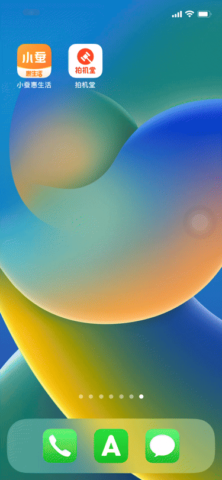

## 1. ShakeShield 用于控制和限制应用内的摇动手势和陀螺仪功能
- **永久禁用**: 完全禁用应用内的摇动手势（默认）
- **开屏禁用**: 在应用启动后的指定时间内禁用摇动手势
- **不禁用**: 保持摇动手势正常工作
> 启动设置：悬浮按钮(默认开启) or 三指双击

## 2. AutoSkip 开屏自动跳过
-- app开启15秒内识别生效，超过时间不再识别

## 3. AutoHelper JavaScript控制
-- [JavaScript开发说明文档](AutoHelper/JavaScript_Guide.md)
-- [麦当劳JavaScript示例](AutoHelper/demo_McDonald.js)